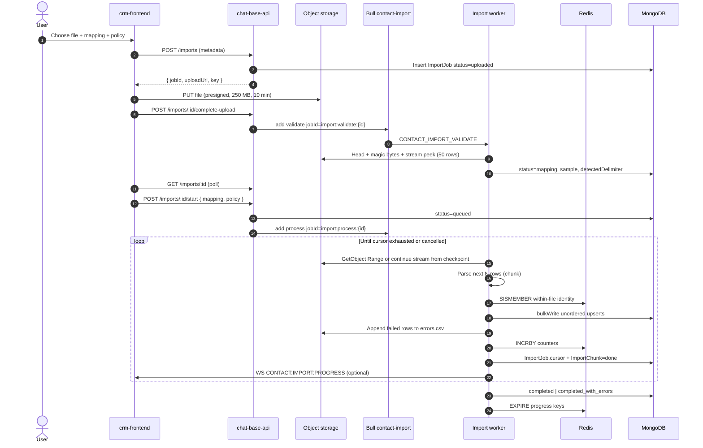
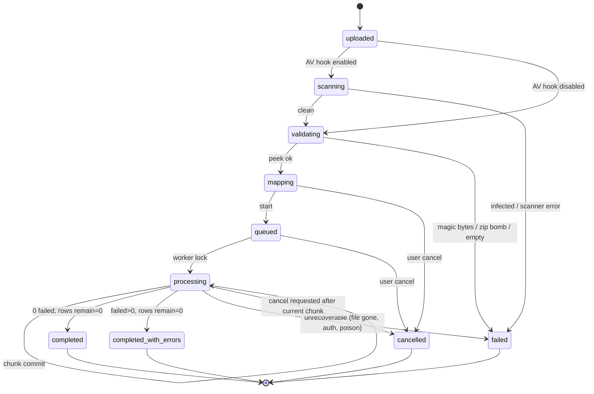
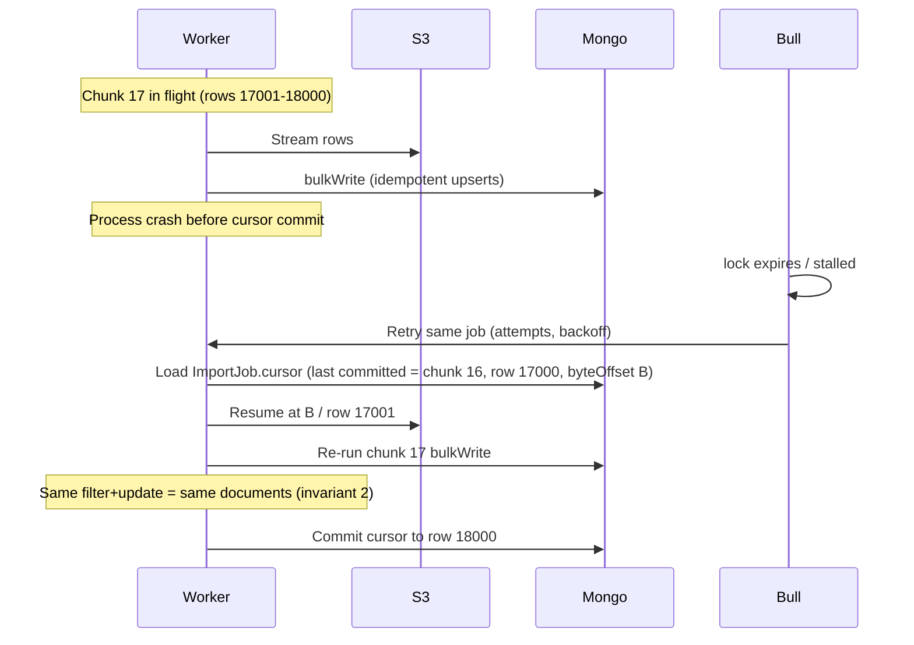

# Contact Import Architecture

**Status:** Accepted  
**Date:** 2026-09-19  
**Owners:** Platform / CRM  
**Scope:** Multi-tenant bulk Contact import (CSV / XLSX) for Kyra CRM  
**Repos:** `chat-base-api`, `crm-frontend`

This is the design of record. Implement against it; do not invent a second import path.

---

## 0. What the current stack already is

Inspected before designing. The import must look like the rest of this product, not like a greenfield service.

| Area | What exists | Implication |
|------|-------------|-------------|
| HTTP envelope | `{ success, responseStatusCode, responseMessage, request, result }` via `http.response.ts`. Lists: `result.docs` + `pagination`. Singles: `result.doc`. | Same envelope. Error codes on `HttpError.code`. |
| Auth / tenancy | JWT → `req.user.organizationId`. `accountId` is **not** in the token; it is a path/body param. `buildRequestContext(req, accountId)`. Contacts today have **no** `requirePermission`. Leads use `leads.create`. | Import routes: `AuthMiddleware.authenticate` + `requirePermission("contacts.import")`. Also seed `contacts.create` / `contacts.view`. Cross-tenant job ids return **404**, never 403. |
| Contacts | `ContactModel`. Partial unique indexes `uniq_account_email` (`accountId+email`, collation en/strength 2) and `uniq_account_phone` (`accountId+phone`). Empty email/phone excluded. `source` / `consent.source` already include `"import"`. WhatsApp `optIn` defaults `true`. | Indexes are the duplicate authority. Never write `""` for email/phone — omit the field. |
| Identity helpers | `normalizeEmail`, `normalizePhone`, `toContactPhone` (E.164, 10-digit → `+91…`), `phoneMatchValues` (legacy variants). Contact form stores 10-digit national numbers. | Import **writes canonical E.164**. Dual-format is a named risk (R1). |
| Upsert today | `ContactService.upsertUniqueContact` is sequential find-then-patch. `upsertManyFromLeads` is a loop. No contact `bulkWrite`. | Import gets its own bulk path. Do not call `upsertUniqueContact` per row. |
| Closest bulk write | `LeadService.createBulkLead`: 1000-row `ChunkUtil.chunkArray`, `bulkWrite({ ordered: false })`, modes `upsert \| insert \| skip`. Then sequential contact sync. Browser Papa Parse + JSON chunks. | Reuse **mode names and batch size**. Do **not** reuse the browser-parse + API-ingest path (it violates the 512 MB / 500k invariants). |
| Queue | **Bull v4**, not BullMQ. Shared queue `"email processing"` already runs email + WhatsApp campaign jobs (`lockDuration` 15 min, `maxStalledCount` 10). WhatsApp also has dedicated queues. Deterministic `jobId` + skip-if-active pattern in campaign services. | Dedicated Bull queue `"contact-import"`. Do not pile 500k-row work onto `"email processing"`. Stay on Bull; do not migrate to BullMQ for this feature. |
| Workers | `npm run worker` → `src/workers/index.ts`. Separate deployable already exists. | Import processors live in that process (or a sibling `worker:import`). |
| Object storage | AWS S3, presigned PUT 600s via `MediaService`. Keys: `tenants/${userId}/…`. Multer 250 MB memory storage exists only for WhatsApp send. | Extend key builder with org+account scoped import prefix. Never multer the import file into the API process. |
| Progress / realtime | `GET /:jobId` is the O(1) snapshot (job document only). `GET /:jobId/events` is SSE (in-process poller). `emitToAccount(accountId, "import.completed", data)` is a best-effort terminal event. | SSE is the live contract for the import wizard. Polling the status snapshot remains valid. |
| Quotas | `USAGE_METRIC.CONTACTS` + `PLAN_LIMIT.CONTACTS`. Soft check at start (`checkLimit` of planned rows). Exact settlement of inserted rows at finalize, CAS by `job.quota.status`. No atomic reserve primitive. | Known limitation: two concurrent starts can both pass the soft check and overshoot the plan until settlement. |
| Mongo | `mongoose.connect(DATABASE_URL)`. Replica set not configured in code. Transactions used for onboarding/WhatsApp connect, **never** for bulk leads/contacts. | No multi-document transactions for import. |
| Frontend contacts | List + global create modal. `source: "import"` already in Zod. Lead import wizard (`UploadStep` → unique key → mapping → progress) is the UX reference, **not** the transport reference. | New route `contacts/import`. File goes to S3; mapping stays in the UI. |
| CSV/XLSX libs | **None** in the API. Frontend Papa Parse is lead-only. | Add streaming parsers on the worker only. |

---

## 1. Assumptions

Stated so this document does not stall on questions.

1. A **workspace** is an `accountId` under an `organizationId`. Isolation is always both.
2. Mongo is (or will be) a **replica set** in production. Dev may be standalone. The design works on both; write concern degrades to `w: 1` when majority is unavailable.
3. Redis is shared with Bull. We may add keys; we will not add a second Redis product.
4. Object storage is the existing AWS S3 bucket / CDN. Lifecycle rules can be added.
5. Default country for 10-digit phones is **India (+91)**, matching `toContactPhone`.
6. Import does not create Leads, conversations, or WhatsApp opt-in events. It writes Contacts only. `whatsapp.optIn` stays the schema default (`true`) unless the file maps an opt-in column.
7. One import job processes **one file, one sheet**. Default is the first **visible** worksheet; `sheetName` may select another. Hidden / veryHidden sheets are skipped unless named.
8. Column mapping is confirmed by a human before the job is queued. Auto-detect is advisory.
9. Duplicate policy default is **`update`** (same spirit as lead bulk upsert).
10. Identity default is **canonical phone, then email**. Configurable per account, stored on the job (not a silent global).
11. Activity logs: **one summary event per job**, not per row.
12. AV scanning is a hook (`ImportScanProvider`). Off by default; when enabled, `uploaded → scanning → validating`.
13. Frontend will not parse 100k+ rows in the browser. Preview is the first 50 rows only (worker or a cheap server peek).
14. `contacts.create` permission will be added to RBAC. Until then, OWNER/ADMIN are treated as allowed in tests.
15. 3,000 rows/sec is **post-validation upsert throughput on a warm replica set**, one worker, canonical-index upserts, no per-row `phoneMatchValues` `$or`.
16. Existing dual-format phones (10-digit vs E.164) are **not** silently merged in v1. A backfill is a separate job (R1).

---

## 2. Options comparison and recommendation (ADR)

### ADR-001: Contact import execution topology

**Context.** Need correctness under crash, 512 MB worker RAM, 500k rows, 50 concurrent tenants, and a stack that already has Bull + S3 + a worker process.

**Options.**

| Option | Reliability | Memory | Throughput | Ops complexity | Cost | Fit with current stack |
|--------|-------------|--------|------------|----------------|------|------------------------|
| **A. Baseline — presign S3 → ImportJob → Bull → streaming worker → unordered bulkWrite → Redis progress → error file** | High if chunks are idempotent and cursor commits after durable writes | O(chunk) | High (3k+/s realistic) | Medium (new queue + 2 collections + S3 lifecycle) | Low (S3 + Redis + existing workers) | **Best.** Presign, Bull, worker, `bulkWrite`, WS/poll all exist. |
| **B. API-process worker** (parse in Express / multer memory) | Poor. Deploy/restart kills jobs. 250 MB multer already exists and would OOM at 50 concurrent. | O(file) or worse | Medium, steals API event loop | Low to ship, high to operate | Hidden (API scale-out) | Reject. Multer memory + shared API process is the opposite of the invariant. |
| **C. In-DB staging collection** (load all rows, then process) | High resume (replay `pending` rows) | O(chunk) at process time; **O(file) in Mongo** | Lower (2× writes) | High (TTL, indexes, PII sprawl) | High (500k docs × 50 jobs) | Weak. We have no staging pattern. Doubles write amplification. |
| **D. Pre-split into chunk files on S3** | High | O(chunk) | High; enables fan-out | High (splitter job, many keys, partial-file GC) | Medium | Extra moving parts we do not have. |
| **E. Kafka / SQS instead of Bull** | High at huge scale | O(chunk) | High | **Very high** (new infra, consumers, DLQ ops) | High | Poor. Redis+Bull already run campaigns. |
| **F. Mongo multi-document transactions per chunk** | False safety. 1000-doc txns + 50 tenants = lock convoys. Standalone dev cannot run them. | O(chunk) | Poor | Medium | Higher (majority + longer locks) | Conflicts with lead bulk precedent and current contact layer. |

**Decision.** **Option A**, with three deliberate refinements (not a different architecture):

1. **Dedicated Bull queue** `"contact-import"` — do not share `"email processing"`.
2. **Sequential chunks per job** (byte-offset / row-index cursor), **not** chunk fan-out. Fan-out breaks last-wins update order and makes within-file dedupe racy.
3. **Status snapshot is O(1) from the job document.** SSE (`GET /:jobId/events`) is the live progress channel: shared per-job in-process poller, 15s comment heartbeat, close on terminal. `import.completed` is a single best-effort account event.

**Why not C.** Staging every row is a second source of truth that will drift from `Contact` unique indexes. Resume is solved more cheaply by an idempotent chunk cursor.

**Why not D/E.** We do not have a splitter, Kafka, or SQS. Horizontal scale is more workers on the same Bull queue.

**Why not F.** Unique indexes + unordered `bulkWrite` + retryable writes are the isolation model. A transaction does not make a unique-index race cleaner; it only holds locks longer.

**Consequences.**

- Must implement magic-byte validation, streaming parsers, and S3 lifecycle.
- Must not reuse `LeadCentre` client-side Papa → `/lead/bulk-write`.
- Phone canonicalization becomes a product decision, not a helper detail.

---

## 3. Diagrams

### 3.1 Data flow



### 3.2 Job state machine



Legal transitions only. **Counters and `status` never move backwards.** A cancelled job does not restart; the user creates a new job.

### 3.3 Failure and resume



---

## 4. API contract

Base: `/api/account/:accountId/contacts/imports`  
Auth: `Authorization: Bearer` + `contacts.import`  
Envelope: existing `{ success, responseStatusCode, responseMessage, request, result }`.  
The user-facing path is singular `account` (repo convention), not `/accounts`.

### 4.1 Endpoints

| Method | Path | Purpose |
|--------|------|---------|
| `POST` | `/` | Create job + presigned POST (policy: exact key, content-length-range, 15 min) |
| `GET` | `/config` | Limits, mappable fields, policies, consent text, org country (or `source: none`) |
| `POST` | `/:jobId/local-upload` | Multipart write to LocalFileStore when `upload.url` is `local-upload://` |
| `POST` | `/:jobId/complete-upload` | HEAD + 4 KB magic; optional AV; enqueue validate |
| `GET` | `/:jobId/preview` | Headers, 20 sample rows, `suggestMapping` (status ≥ mapping) |
| `POST` | `/:jobId/dry-run` | Head-sample map/validate; no contact writes; existing `$in` matches |
| `GET` | `/:jobId` | O(1) job-document snapshot |
| `GET` | `/:jobId/events` | SSE snapshots + 15s heartbeat |
| `GET` | `/` | Cursor-paginated list for the account |
| `POST` | `/:jobId/start` | Mapping + required `defaultCountry` + quota check + `startImport` |
| `POST` | `/:jobId/cancel` | Cooperative cancel |
| `POST` | `/:jobId/pause` | Pause after current chunk |
| `POST` | `/:jobId/resume` | Resume from `paused` |
| `GET` | `/:jobId/errors` | Short-lived presigned GET of `reports/{jobId}/errors.csv` |

No `PATCH` of mapping after `queued`.

### 4.2 Request / response shapes

```typescript
type DuplicatePolicy = "skip" | "update" | "merge";
type IdentityField = "phone" | "email";
type ImportStatus =
  | "uploaded"
  | "scanning"
  | "validating"
  | "mapping"
  | "queued"
  | "processing"
  | "paused"
  | "completed"
  | "completed_with_errors"
  | "failed"
  | "cancelled";

interface ImportFieldMapping {
  /** CSV/XLSX header, exact */
  source: string;
  /** Contact field or ignore */
  target:
    | "name"
    | "email"
    | "phone"
    | "status"
    | "tags"
    | "whatsapp.optIn"
    | "ignore";
}

interface ImportIdentityConfig {
  /** First match wins. Default ["phone", "email"]. */
  keys: IdentityField[];
}

interface MergeRules {
  /** Default: fill empty targets only. */
  emptyOnly: Array<"name" | "email" | "phone" | "tags">;
  /** Default: union. */
  tags: "union" | "replace";
  /** Never overwrite unsubscribed/bounced with subscribed from file unless true. */
  allowStatusUpgrade: boolean;
}

interface CreateImportRequest {
  fileName: string;
  mimeType: string;
  fileSize: number;
  checksumSha256?: string;
}

interface CreateImportResult {
  doc: {
    id: string;
    status: "uploaded";
    uploadUrl: string;
    key: string;
    expiresInSec: 600;
    maxBytes: number; // 262144000
  };
}

interface StartImportRequest {
  mapping: ImportFieldMapping[];
  policy: DuplicatePolicy;
  identity?: ImportIdentityConfig;
  merge?: MergeRules;
  defaultCountry: string; // required 2-letter ISO; no org / "IN" fallback
  // Assignment is not supported in v1. Unknown keys (including defaultAssigneeId) are 400.
}

interface ImportProgress {
  totalRows: number | null; // null until validate finishes
  processed: number;
  inserted: number;
  updated: number;
  skipped: number;
  failed: number;
  rowsPerSec: number;
  etaSec: number | null;
}

interface ImportJobDoc {
  id: string;
  accountId: string;
  organizationId: string;
  status: ImportStatus;
  fileName: string;
  mimeType: string;
  fileSize: number;
  policy: DuplicatePolicy;
  identity: ImportIdentityConfig;
  mapping?: ImportFieldMapping[];
  sampleRows: string[][];
  headers: string[];
  progress: ImportProgress;
  errorMessage?: string;
  errorReportKey?: string;
  createdAt: string;
  updatedAt: string;
}
```

List uses existing `buildPagination`.

### 4.3 Error codes

| `code` | HTTP | When |
|--------|------|------|
| `IMPORT_FILE_TOO_LARGE` | 400 | `fileSize > 250 MB` |
| `IMPORT_UNSUPPORTED_TYPE` | 400 | Magic bytes / MIME mismatch |
| `IMPORT_ZIP_BOMB` | 400 | XLSX compression / sharedStrings cap |
| `IMPORT_EMPTY` | 400 | 0 data rows |
| `IMPORT_INVALID_STATE` | 400 | Illegal transition |
| `IMPORT_NOT_FOUND` | 404 | Wrong account or id |
| `IMPORT_QUOTA_ACTIVE` | 429 | Account already has 2 active jobs |
| `IMPORT_TENANT_FAIRNESS` | 429 | Org-level concurrency cap |
| `IMPORT_SCAN_REJECTED` | 400 | AV hook |
| `CONTACTS_CREATE_FORBIDDEN` | 403 | RBAC |
| `FEATURE_NOT_AVAILABLE` | 403 | Subscription (phase 2) |

Frontend reads `error.message` / `code` the same way as email/WhatsApp campaign errors.

---

## 5. Mongo collections, fields, indexes

### 5.1 Existing `contacts` — do not weaken

```javascript
// already live — final duplicate authority
{ accountId: 1, email: 1 }  // name: uniq_account_email
  unique: true
  collation: { locale: "en", strength: 2 }
  partialFilterExpression: { email: { $type: "string", $gt: "" } }

{ accountId: 1, phone: 1 }  // name: uniq_account_phone
  unique: true
  partialFilterExpression: { phone: { $type: "string", $gt: "" } }
```

Import writes must omit missing email/phone. Add **no** `importJobId` unique key — identity is phone/email.

Optional non-unique (phase 2, analytics only):

```javascript
{ accountId: 1, source: 1, createdAt: -1 }  // name: idx_account_source_created
```

### 5.2 `contact_import_jobs`

```typescript
interface ContactImportJob {
  _id: ObjectId;
  organizationId: ObjectId;
  accountId: ObjectId;
  createdBy: ObjectId;
  status: ImportStatus;
  file: {
    bucket: string;
    key: string;
    fileName: string;
    mimeType: string;
    byteSize: number;
    sha256?: string;
    detected: {
      kind: "csv" | "xlsx";
      encoding: "utf-8" | "utf-16le" | "windows-1252";
      delimiter: "," | ";" | "\t" | "|";
      hasBom: boolean;
      sheetNames?: string[];
      sheetName?: string;
      date1904?: boolean;
    };
  };
  policy: DuplicatePolicy;
  identity: ImportIdentityConfig;
  mapping: ImportFieldMapping[];
  merge: MergeRules;
  sampleRows: string[][];
  headers: string[];
  cursor: {
    /** CSV: byte offset AFTER last committed record. XLSX: unused. */
    byteOffset: number;
    /** 1-based data row last committed (excludes header). */
    rowNumber: number;
    sheetIndex: number;
    chunkIndex: number;
  };
  counters: {
    totalRows: number;
    processed: number;
    inserted: number;
    updated: number;
    skipped: number;
    failed: number;
  };
  cancelRequested: boolean;
  pauseRequested: boolean;
  errorMessage?: string;
  errorReportKey?: string;
  startedAt?: Date;
  completedAt?: Date;
  createdAt: Date;
  updatedAt: Date;
}
```

```javascript
{ accountId: 1, createdAt: -1 }           // name: idx_import_account_created
{ organizationId: 1, status: 1 }          // name: idx_import_org_status
{ status: 1, updatedAt: 1 }               // name: idx_import_status_updated (worker sweep)
{ createdAt: 1 }                          // name: ttl_import_jobs, expireAfterSeconds: 7776000 (90d)
```

### 5.3 `contact_import_chunks`

One document per committed (or in-flight) chunk. Replay of `status: "done"` is a no-op.

```typescript
interface ContactImportChunk {
  _id: ObjectId;
  jobId: ObjectId;
  organizationId: ObjectId;
  accountId: ObjectId;
  index: number;          // 0-based
  startRow: number;       // inclusive, 1-based data rows
  endRow: number;         // inclusive
  byteOffsetStart: number;
  byteOffsetEnd: number;
  status: "pending" | "processing" | "done" | "failed";
  attempts: number;
  inserted: number;
  updated: number;
  skipped: number;
  failed: number;
  error?: string;
  lockedAt?: Date;
  completedAt?: Date;
}
```

```javascript
{ jobId: 1, index: 1 }                    // name: uniq_import_chunk, unique: true
{ jobId: 1, status: 1 }                   // name: idx_import_chunk_status
```

### 5.4 Failed rows — not a Mongo collection

Failed rows go to S3 `errors.csv` (append-only multipart or buffered 4 KB flushes). Mongo is the wrong store for 50k error lines of PII.

Each error line: `rowNumber,reason,raw_col1,raw_col2,…` with CSV-injection sanitization (§8).

### 5.5 Write concern and retries

| Write | Concern | Why |
|-------|---------|-----|
| `contacts.bulkWrite` | `w: "majority"` when RS; else `w: 1`. `ordered: false`. `retryWrites: true` (URI). | Unique-index races must surface as write errors, not roll back the chunk. |
| `ImportJob.cursor` + chunk `done` | Same majority, **after** bulkWrite ack | Cursor never advances past undurable contact writes (invariant 1). |
| Redis counters | Best-effort | Source of display; Mongo counters overwritten only with `max(current, redis)` so they never go backwards (invariant 5). |

**No multi-document transaction.** A 1,000-doc txn across 50 tenants serializes the working set. `E11000` on `uniq_account_email` / `uniq_account_phone` is the race resolver, including concurrent imports and the create-contact modal.

---

## 6. Worker algorithm (including resume)

### 6.1 Constants

```
CHUNK_ROWS            = 1000          // match LeadService BATCH_SIZE
MAX_FILE_BYTES        = 250 * 1024 * 1024
MAX_ROWS              = 500_000
MAX_XLSX_UNCOMPRESSED = 400 * 1024 * 1024
MAX_XLSX_RATIO        = 100
MAX_XLSX_ENTRIES      = 64
MAX_XLSX_ENTRY_BYTES  = 250 * 1024 * 1024
MAX_XLSX_FILE_BYTES   = 250 * 1024 * 1024
MAX_XLSX_ROWS         = 500_000
MAX_SHARED_STRINGS    = 32 * 1024 * 1024
MAX_ACTIVE_PER_ACCOUNT= 2
GLOBAL_WORKER_CONCURRENCY = 8         // per process; scale processes for 50 tenants
PER_TENANT_IN_FLIGHT  = 1
PROGRESS_FLUSH_MS     = 2000
ERROR_BUFFER_BYTES    = 4096
STREAM_HIGHWATER      = 16 * 1024
```

### 6.2 Parsing

**CSV**

- Source: `S3.GetObject` (or `Range` on resume) piped to `csv-parse` (`relax_quotes`, `skip_empty_lines`, `bom: true`).
- Encoding: detect BOM (`EF BB BF`, `FF FE`, `FE FF`). Else treat as UTF-8; on high replacement-character rate in the peek, retry windows-1252 once.
- Delimiter: sniff first 8 KB among `, ; \t |` by column-count variance. User cannot override in v1.
- Dates: if mapped field is not a date field, keep raw string. v1 Contact schema has no date columns.
- Phone: `toContactPhone(raw)` (digits, 10 → `+91`, else `+{digits}`). Invalid (<10 digits) → failed row `INVALID_PHONE`.
- Email: `normalizeEmail`. Invalid → failed row `INVALID_EMAIL` only if email is the sole identity key; else omit email and continue if phone is valid.
- Memory: parser + current chunk array. Never `fs.readFile`.

**XLSX**

- Input is a local temp file (already downloaded by FileStore / B8). Magic: ZIP `50 4B 03 04` is OK. OLE2 `D0 CF 11 E0 A1 B1 1A E1` is a typed `IMPORT_UNSUPPORTED_TYPE` ("password-protected or legacy .xls — save as .xlsx or CSV"). EncryptedPackage / EncryptionInfo is the same reject.
- Open with `yauzl` (`lazyEntries`, `validateEntrySizes`). Caps (env, defaults below) are enforced on **declared** sizes and on **actual** inflated bytes via a counting transform that aborts the stream: max entries 64, max total uncompressed 400 MB, max per-entry 250 MB, max compression ratio 100:1. File bytes 250 MB. Rows 500k. Columns 64.
- Reject any XML part containing `DOCTYPE` or `ENTITY` declarations.
- Only read `xl/workbook.xml`, `xl/_rels/workbook.xml.rels`, `xl/sharedStrings.xml`, `xl/styles.xml`, and the one chosen worksheet. Everything else (vbaProject, drawings, charts, calcChain, printer settings) is ignored.
- Sheet selection: first **visible** sheet by default; optional `sheetName`. Persist `file.detected.sheetNames`, `sheetName`, and `date1904`.
- SharedStringTable is one concatenated UTF-8 Buffer plus a `Uint32Array` of offsets (no per-string JS objects). Rich-text runs (`<r><t>`) are concatenated; phonetic `<rPh>` is skipped; `xml:space` is respected. Cap `IMPORT_MAX_SHARED_STRINGS_BYTES` (32 MB) with a message to upload CSV.
- `styles.xml`: `numFmts` + `cellXfs` decide which style ids are dates (built-in date formats plus custom codes that look like dates).
- SAX over the sheet, namespace-agnostic. Cell types `s | str | inlineStr | b | n | e | d`. Formulas use the cached `<v>`. Cells are placed by `r="C5"`, gaps filled with empty fields. Fully empty rows are skipped. Abort early on row/column caps.
- Numbers never emit scientific notation for integer-valued values (phones stored as numbers). Date cells → ISO 8601 using the workbook date system (1900 epoch `1899-12-30` UTC, or 1904). Booleans → `TRUE`/`FALSE`. Error cells → empty.
- Output is RFC 4180, `"\n"` rows, UTF-8 without BOM, comma delimiter, written with backpressure to `{sourceKey}.canonical.csv`. Same input is byte-identical. Write is atomic (`.part` + rename). Long converts yield the event loop and refresh the Bull job lock/progress so validate does not stall.
- Do **not** use `XLSX.read` / ExcelJS `workbook.xlsx.load` (those are O(file)).
- After conversion, chunk planning and resume are the CSV path (byte offsets). The XLSX is not re-parsed per chunk.

**Decompression / zip-bomb** applies only to XLSX. CSV is not inflated.

**Unsupported:** `.xls` / OLE2, password-protected workbooks, macros (ignored), charts/pivots (ignored), formula results other than the cached value. Converter dates are ISO-8601, not Excel's locale display.

### 6.3 Identity and duplicates

**Against DB.** The unique indexes are the authority (invariant 4).

Canonical identity for a row:

```
phoneKey = toContactPhone(mapped.phone)
emailKey = normalizeEmail(mapped.email)
identity = first defined among job.identity.keys mapped to phoneKey/emailKey
if none → fail INVALID_IDENTITY
```

`bulkWrite` filter (in key order):

```
if identity is phone → { accountId, phone: phoneKey }
else → { accountId, email: emailKey }
```

If the document also carries the other field, include it in `$set` / `$setOnInsert`. A unique violation on the **other** index is a failed row `DUPLICATE_OTHER_IDENTITY` (same phone, different email already owned by another contact, or the reverse).

**Within file.** Redis set `import:{jobId}:seen` of `sha1(accountId + '\0' + kind + '\0' + key)`.

- `skip`: if seen or DB hit → skip; record first row number in `import:{jobId}:seenrow`.
- `update` / `merge`: still mark seen for metrics; later rows still write (last-wins). Redis is not required for last-wins, only for skip.

Worker memory stays O(chunk). Redis holds O(unique keys) off-process (invariant 3).

**Policies**

| Policy | Existing contact | Write |
|--------|------------------|-------|
| `skip` | found | none; `skipped++` |
| `update` | found | `$set` mapped fields (except identity keys and `status` unless `allowStatusUpgrade`) |
| `merge` | found | `$set` only empty-on-target fields per `merge.emptyOnly`; `tags` union; never clear email/phone |
| any | not found | `$setOnInsert` full document, `source: "import"`. Consent/opt-out only here — never on update/merge. |

`update`/`merge` never delete fields. `status: unsubscribed|bounced` is sticky unless `allowStatusUpgrade`.

### 6.4 Pseudocode

```
function processImport(jobId):
  job = loadJob(jobId)
  if job.status in terminal: return
  if job.status == queued: transition(job, processing); job.startedAt = now()

  acquireTenantSlot(job.accountId)          // Redis SET NX EX, max PER_TENANT_IN_FLIGHT
  try:
    stream = openSource(job)                // CSV: Range from job.cursor.byteOffset
    parser = makeParser(job, stream)
    chunk = []
    chunkStartRow = job.cursor.rowNumber + 1
    chunkStartBytes = job.cursor.byteOffset
    skippedForResume = 0

    for record in parser:                   // record includes raw[], rowNumber, byteEnd
      if cancelled(job): transition(cancelled); return
      if paused(job): transition(paused); return
      if job.file.kind == "xlsx" and record.rowNumber <= job.cursor.rowNumber:
        continue                            // resume skip
      if job.file.kind == "csv" and record.rowNumber <= job.cursor.rowNumber:
        continue                            // belt and suspenders with Range

      chunk.append(record)
      if chunk.length == CHUNK_ROWS:
        commitChunk(job, chunk, chunkStartBytes)
        chunkStartBytes = last(chunk).byteEnd
        chunk = []
        flushProgressIfDue(job)

    if chunk.length:
      commitChunk(job, chunk, chunkStartBytes)

    finalize(job)                           // completed vs completed_with_errors
  finally:
    releaseTenantSlot(job.accountId)


function commitChunk(job, rows, byteStart):
  index = job.cursor.chunkIndex + 1
  existing = chunks.findOne({ jobId, index })
  if existing?.status == "done":
    return                                  // invariant 2

  chunks.updateOne({ jobId, index },
    { $setOnInsert: { startRow, endRow, byteOffsetStart: byteStart, status: "processing" } },
    { upsert: true })

  ops = []
  failures = []
  for row in rows:
    mapped = applyMapping(row.raw, job.mapping)
    result = normalizeAndValidate(mapped, job)
    if result.fail:
      failures.append({ row: row.rowNumber, raw: row.raw, reason: result.fail })
      continue
    if job.policy == "skip" and redis.sismember(seenKey, result.seenId):
      counters.skipped++; continue
    redis.sadd(seenKey, result.seenId)
    ops.append(buildBulkOp(job, result))    // updateOne upsert, filter by identity

  writeErrs = []
  if ops.length:
    try:
      res = Contact.bulkWrite(ops, { ordered: false, writeConcern: MAJORITY })
      accountInsertedUpdated(res)
    catch BulkWriteError as e:
      // successful ops in e.result still count
      accountInsertedUpdated(e.result)
      for err in e.writeErrors:
        writeErrs.append(toRowFailure(ops, err))   // E11000 → DUPLICATE_OTHER_IDENTITY

  appendErrorReport(job, failures + writeErrs)     // buffered
  redis.incrby processed/inserted/updated/skipped/failed

  chunks.updateOne({ jobId, index }, { $set: { status: "done", ...counts } })
  ImportJob.updateOne({ _id: job.id, "cursor.chunkIndex": index - 1 },
    { $set: {
        "cursor.chunkIndex": index,
        "cursor.rowNumber": last(rows).rowNumber,
        "cursor.byteOffset": last(rows).byteEnd
      },
      $max: {                          // invariant 5
        "counters.processed": redis.processed,
        "counters.inserted": redis.inserted,
        ...
      }
    })
  // If the cursor filter matches 0 docs, another worker advanced it — stop.


function buildBulkOp(job, row):
  filter = identityFilter(job.accountId, row)
  setOnInsert = {
    accountId, source: "import",
    consent: job.consentAttestation?.confirmed
      ? { marketing: true, source: "import", timestamp: now }
      : { marketing: false, source: "import", timestamp: now },
    whatsapp: { optIn: row.optIn ?? true, source: "" },
    createdAt: now
  }
  // Consent, whatsapp opt-in/out, and blocked fields are NEVER in $set.
  set = policySet(job.policy, row)          // never $unset identity
  return {
    updateOne: {
      filter,
      update: { $set: set, $setOnInsert: setOnInsert, $currentDate: { lastActivity: true } },
      upsert: job.policy != "skip" or true  // skip uses a pre-check via upsert+E11000
    }
  }

  // skip implementation detail:
  // prefer updateOne upsert:false after a hinted find in the same bulk is impossible.
  // For skip: use updateOne with upsert:true and $setOnInsert only (no $set).
  // If the doc exists, modified=0 → skipped. If inserted, inserted++.
```

**Idempotent chunk:** same `filter` + same `$set` / `$setOnInsert`. Re-running chunk 17 cannot create a second contact (unique index) and cannot roll counters backward (`$max`).

**Skip via `$setOnInsert` only** is the bulk-friendly skip. No pre-read.

### 6.5 Queue design

New file: `src/queue/contact-import.queue.ts`.

```
Queue name: "contact-import"
defaultJobOptions:
  attempts: 8
  backoff: { type: "exponential", delay: 3000 }
  timeout: 30 * 60 * 1000
  removeOnComplete: 100
  removeOnFail: 50
settings:
  lockDuration: 10 * 60 * 1000
  lockRenewTime: 20 * 1000
  stalledInterval: 30 * 1000
  maxStalledCount: 5
limiter: { max: 20, duration: 1000 }   // coarse global; fairness is Redis slots
```

Jobs (deterministic ids, same skip-if-active pattern as campaigns):

| Job | `jobId` | Concurrency |
|-----|---------|-------------|
| `CONTACT_IMPORT_VALIDATE` | `import:validate:{importId}` | 4 |
| `CONTACT_IMPORT_PROCESS` | `import:process:{importId}` | 8 per process |
| `CONTACT_IMPORT_CLEANUP` | `import:cleanup:{importId}` | 2 |

**Fairness.** `SET import:slot:{accountId} NX EX 600`. If denied, **delay** the job 15s (do not fail). Org-level counter `import:org:{organizationId}` cap 8. This is how one tenant cannot occupy all 50 global slots.

**Retries.** Parser/network/Mongo transient → throw → Bull retry. Validation poison (zip bomb, bad magic) → mark `failed`, `attempts` not exhausted usefully (`fail` with `UnrecoverableError` equivalent: catch and `transition(failed)` without throw).

**Stalled.** Bull redelivers. Resume from cursor. `maxStalledCount: 5` then `failed` + alert.

**DLQ.** Bull failed set + `status: failed` is the DLQ. Ops inspect Mongo, not a second queue.

**Cancel / pause.** Flags on the job. Worker checks between chunks. In-flight chunk finishes (so the cursor stays consistent).

### 6.6 Progress

```
Redis HASH import:prog:{jobId}  { processed, inserted, updated, skipped, failed, startedAt }
Flush every 2s or every chunk with $max into Mongo.
GET /imports/:id reads Mongo (authoritative for refresh) and overlays Redis if newer.
WS: emitToAccount(accountId, "CONTACT:IMPORT:PROGRESS", { importId, ...counters })
```

Never `INCR` then later `DECR`. Failures increment `failed` and `processed` only.

---

## 7. Failure-mode table

| Failure | Detection | Recovery | Data impact |
|---------|-----------|----------|-------------|
| Browser dies during S3 PUT | Job stays `uploaded`; no `complete-upload` | TTL 24h cleanup deletes job + incomplete key | No contacts written |
| Presign expired | S3 403 | Client requests a new job (do not reuse ids) | None |
| Magic-byte / MIME lie | Validate Head + first 8 bytes | `failed` / `IMPORT_UNSUPPORTED_TYPE` | None |
| Zip bomb / huge sharedStrings | Caps in validate | `failed` / `IMPORT_ZIP_BOMB` | None |
| Worker OOM | Bull stalled | Retry from cursor; if XLSX, user is already on CSV for large files | Last uncommitted chunk replayed; no dupes |
| Worker process kill mid-chunk | lock expiry / stalled | Replay chunk (idempotent upserts) | Possible double-count **attempt** avoided by `$max` + done-chunk short-circuit |
| Mongo `E11000` other identity | `writeErrors` | Row → error report; rest of chunk kept (`ordered: false`) | That row not applied; others committed |
| Concurrent manual create same phone | Unique index | Same as E11000 or upsert update | One contact; import row update or fail, never two |
| Two imports same account | Per-account slot + unique index | Second job delayed or both write; index serializes | No duplicate contacts |
| Redis down | INCR fails | Proceed; flush uses in-memory delta then Mongo `$max` | Progress UI lags; data correct |
| S3 GetObject fail | AWS error | Bull retry | No cursor advance |
| Error-report append fail | S3 error | Fail chunk (throw) so it retries; do not advance cursor | Prefer stall over silent lost errors (invariant 6) |
| Poison row (huge cell) | Cell byte cap 8 KB | Fail that row `CELL_TOO_LARGE` | Others proceed |
| Cancel during chunk | Flag | Finish chunk, then `cancelled` | Chunk results kept (documented) |
| Replica set failover | retryable writes | Driver retry; else Bull retry | Replay safe |
| Wrong mapping (email column = name) | User | New job; cannot rewind | Bad data possible; not a crash invariant |
| Dual-format phone miss | Existing `9876…` vs import `+919876…` | Unique index treats them different (R1) | **Possible duplicate contact** until backfill |

---

## 8. Security, cleanup, observability

### Security

- **Magic bytes, not extension:** complete-upload HEADs the object, ranged-GETs the first 4 KB. XLSX = `PK\x03\x04`. CSV = no NUL bytes. Extension and `contentType` are advisory.
- **Size:** declared `fileSize` must equal object size and stay within the 250 MB cap. Mismatch → `400 IMPORT_SIZE_MISMATCH`.
- **Presign:** POST + policy conditions: exact key, `content-length-range` `[1, cap]`, 15 min expiry. Never log the URL or file contents.
- **Keys:** `uploads/{organizationId}/{accountId}/{jobId}/source.{csv|xlsx}` and `reports/{jobId}/errors.csv`.
- **Bucket assumptions:** public access blocked, SSE at rest, CORS for the app origin, lifecycle expire `uploads/` and abort incomplete multipart.
- **CSV injection on export:** if a field starts with `= + - @ \t \r`, prefix `'`.
- **PII:** source + error files are account-scoped; signed GET 5 min; no public ACL. Logs carry `jobId`, `accountId`, `organizationId`, **not** raw phones/emails (hash suffix ok).
- **Rate / quota:** `IMPORT_MAX_ACTIVE_PER_ACCOUNT` non-terminal jobs and `IMPORT_MAX_CREATES_PER_HOUR` creates (env, 429). Contact capacity is a soft check at start plus exact inserted settlement at finalize.
- **AV hook:** `ScanPort` (default `NoopScanner`) when `IMPORT_AV_SCAN_ENABLED=1`, using the `uploaded → scanning → validating` transition. Fail closed when the hook is enabled.
- **Formula / XSS:** mapping UI treats cells as text. No `dangerouslySetInnerHTML` of cells.
- **Consent:** `POST /start` may send `consentAttestation: { confirmed: true }`. The job stores `{ userId, at, ip, userAgent, textVersion }`. Attested inserts write `{ marketing: true, source: "import", timestamp }`. Without attestation, new contacts keep the ContactModel default (`marketing: false`). Update/merge never write consent, opt-out, or blocked fields (`$setOnInsert` / insert-only `$cond`).

### Cleanup

| Artifact | TTL |
|----------|-----|
| Source object | S3 lifecycle 7 days |
| Error report | S3 lifecycle 30 days |
| `contact_import_jobs` | Mongo TTL 90 days |
| `contact_import_chunks` | Delete when job TTL fires (same `createdAt` or jobId sweep) |
| Redis `import:*` | `EXPIRE` 7 days after terminal state |
| Abandoned `uploaded` | Cron 24h → delete key + job |

### Observability

Metrics (prefix `contact_import_`):

- `rows_per_sec` (worker histogram)
- `queue_lag_ms` (waiting job age)
- `chunk_latency_ms`
- `failure_rate` = failed / processed
- `jobs_in_flight` by status
- `tenant_slot_denied_total`

Logs: `logger.info("CONTACT_IMPORT_CHUNK", { jobId, accountId, organizationId, chunkIndex, rows, ms, inserted, failed })`.

Alerts:

- `queue_lag_ms` p95 > 10 min
- stalled jobs > 0 for 5 min
- failure_rate > 20% on jobs with processed > 1000
- worker RSS > 400 MB

---

## 9. Folder / module structure

Follow `src/modules/whatsapp/broadcast/` (feature folder) plus existing `controllers` / `routes` mount style.

```
chat-base-api/
  src/modules/contacts/import/
    constants/import.constant.ts
    models/contact-import-job.model.ts
    models/contact-import-chunk.model.ts
    dtos/import.dto.ts                 // class validators, throw HttpError
    services/contact-import.service.ts // API-facing
    services/contact-import-processor.service.ts
    services/parsers/csv.parser.ts
    services/parsers/xlsx.parser.ts
    services/parsers/magic-bytes.ts
    services/error-report.writer.ts
    services/progress.store.ts         // Redis + $max flush
    utils/import-normalize.util.ts     // wraps phone.util / email
    controllers/contact-import.controller.ts
    types/import.types.ts
  src/queue/contact-import.queue.ts
  src/workers/contact-import.worker.ts
  src/routes/contact-import.routes.ts  // mounted in routes/index.ts
  src/constants/queue-jobs.constant.ts // + CONTACT_IMPORT_*
  src/utils/s3-key.builder..utils.ts   // + IMPORT case, org/account keys

crm-frontend/
  src/pages/Contact/pages/ImportContact.page.tsx
  src/pages/Contact/components/import/
    UploadStep.tsx                     // presign, not Papa-full-file
    MappingStep.tsx
    PolicyStep.tsx
    ProgressStep.tsx
  src/pages/Contact/services/contact-import.service.ts
  src/constants/routes/contact.path.ts // + import
  src/routes/contact.routes.tsx
```

Reuse: `httpResponse`, `handleRouteError`, `buildRequestContext`, `buildPagination`, `ActivityLogService.logCreate` (one `contact_import` entity), `FeatureGate` only if a metric is added.

**Do not** add `POST /contacts/bulk-write` that accepts 1000 JSON leads from the browser.

---

## 10. Phased implementation plan

Each phase ships independently and has tests. Later phases do not rewrite earlier collections.

### Phase 0 — Contract and storage (1–2 days)

- Models + indexes + S3 key + presign create/complete-upload.
- State: `uploaded` only.
- Tests: DTO validation, key shape, size/MIME reject, envelope.

**Ship:** user can upload a file that nobody processes.

### Phase 1 — Validate + mapping peek (2–3 days)

- `CONTACT_IMPORT_VALIDATE`: magic bytes, HeadObject size, CSV sniff, 50-row sample.
- XLSX peek with zip caps; stream-convert to canonical CSV.
- Tests: fixtures for BOM CSV, `;` delimiter, fake `.csv` that is ZIP, zip-bomb, empty file.

**Ship:** UI mapping screen with real headers.

### Phase 2 — Sequential CSV process (core) (4–6 days)

- PROCESS job, chunk 1000, `$setOnInsert` skip / update / merge, Redis seen-set, error report, `$max` counters, cancel/pause.
- Tests: 10k-row fixture; kill worker after chunk 3 and assert row count + no dupes; replay chunk; E11000 other-identity; injection-prefixed error CSV; progress never decreases.

**Ship:** production CSV import up to 500k.

### Phase 3 — Fairness, WS, RBAC, cleanup (2 days)

- Tenant slots, org cap, `contacts.create`, WS event, TTL/lifecycle, metrics.
- Tests: two jobs same account, third delayed; cancel mid-job; abandoned upload cron.

**Ship:** multi-tenant safe.

### Phase 4 — XLSX streaming (done with this phase)

- Streaming ZIP → SAX first visible sheet → atomic canonical CSV.
- Shared strings as one Buffer + offsets; zip-bomb caps on actual bytes.
- Tests: two writers (exceljs + SheetJS), `tests/fixtures/xlsx/real/`, bombs, 500k scale, 100k fake-queue e2e.

### Phase 5 — Hardening (ongoing)

- Contact usage metric, AV hook, phone backfill (R1), optional `idx_account_source_created`.
- Load test: 100k CSV, 8 workers, 20 accounts, assert ≥ 3k rows/s/worker and RSS < 512 MB.

---

## 11. Top 5 risks and open questions

### Risks (in order)

1. **Phone representation split.** Live contacts are often 10-digit national; import will write `+91…`. Unique index will **not** collide, so the same human can exist twice. Throughput forbids per-row `phoneMatchValues` `$or`. Mitigation: ship a one-off backfill to `toContactPhone`, and document that v1 import matches E.164 only. This is the highest correctness risk.

2. **XLSX shared strings can still blow the 32 MB SST cap** (many unique long strings). Mitigation: reject with “upload a CSV instead.” Streaming conversion removes the old 80k-row / 25 MB convert-once cap.

3. **`ordered: false` + `$max` counters can disagree with “inserted” vs “updated”** on replay (driver `upsertedCount` on a replay is 0). Mitigation: treat replay of `done` chunks as a no-op; never increment from a replayed writeError set. Tests must lock this.

4. **50 concurrent imports × `w: majority` × unique indexes** can create hot-spot latency on `{ accountId, phone }` if many tenants are small ObjectIds in the same shard/chunk. We are not sharded today. Mitigation: pool size, 1 job per account, watch `chunk_latency_ms`. If p95 exceeds 2s, drop chunk size to 500 before adding Kafka.

5. **Sharing operational fate with Redis.** Bull locks, fairness slots, and seen-sets all die if Redis dies. Mitigation: process can continue a chunk with in-memory seen for **that chunk only**; skip-across-chunks degrades to DB-only (unique index). Document Redis as required for skip-in-file, not for no-dupes-in-DB.

### Open questions (do not block Phase 2)

- Should imported contacts default `whatsapp.optIn` to `false` (stricter marketing) instead of schema default `true`?
- Is `contacts.create` the right permission, or do we need `contacts.import`?
- Do we count imported rows against a new `USAGE_METRIC.CONTACTS` in the same sprint as Phase 2?
- Country default besides IN for E.164?
- After R1 backfill, do we change the contact form to store E.164 so the unique index finally matches the import path?

---

## Appendix — Scale flags

| Target | Verdict |
|--------|---------|
| 100k rows typical CSV | Comfortable on Phase 2. |
| 500k rows / 250 MB CSV | Design supports it; needs Phase 5 load test. |
| 500k XLSX | Streaming convert-once to canonical CSV; SST cap 32 MB; zip-bomb caps as in §6.1. |
| 3,000 rows/s/worker | Realistic **only** with canonical-index upserts and no per-row find. Extra `$or` identity lookups make ~500–1,000/s more likely. |
| 50 concurrent tenants | Needs **multiple worker processes** (8 concurrency × N boxes) plus fairness slots. One box cannot honestly run 50 × 3k/s. |
| Millions of contacts / tenant | Indexes as defined are sufficient. Compaction/TTL are on import artifacts, not contacts. |

---

## Appendix — Why this is not the lead importer

The lead wizard parses the whole CSV in the browser and posts JSON batches to the API. That path:

- uses O(file) memory in the tab,
- puts parse CPU on the client,
- has no crash-resume cursor,
- has no error-report file,
- syncs contacts **sequentially** after each lead batch (`upsertManyFromLeads`).

It is fine for small lead lists. It is forbidden for this feature.

---

## Appendix — Accepted deviations (source of truth for the as-built worker)

Phases 1, 2A, and 2B shipped. These are the accepted differences from earlier sections of this document. Implement and review against this appendix, not the superseded sketches.

### Object key layout

Not `tenants/{organizationId}/{accountId}/imports/{importId}/…` and not the media `tenants/{userId}/` prefix.

| Artifact | Key |
|----------|-----|
| Upload | `uploads/{organizationId}/{accountId}/{jobId}/source.{csv\|xlsx}` |
| XLSX canonical CSV | `{sourceKey}.canonical.csv` |
| Per-chunk error part | `errors/{jobId}/{index}.csv` |
| Merged report | `reports/{jobId}/errors.csv` |

`FileStore.createReadStream` range `end` is **inclusive** (Node `fs` and S3 `Range: bytes=start-end`). Chunk descriptors use exclusive `byteOffsetEnd`; readers pass `end: byteOffsetEnd - 1`.

### Bindings B1–B11 as built

| Id | Behavior |
|----|----------|
| B1 | `import:validate` CAS `uploaded`/`scanning` → `validating` → inspect → persist `file.detected`, `totalRows`, `totalChunks`, planned chunk docs → `mapping`. |
| B2 | Promote `queued` → `processing` only when Mongo-computed org `processing` count is below `IMPORT_ORG_ACTIVE_SLOTS` (default 2). |
| B3 | Dispatch up to `IMPORT_DISPATCH_K` (default 3) in-flight chunk jobs per import. Deterministic Bull ids: `validate-{jobId}`, `chunk-{jobId}-{index}`, `finalize-{jobId}`. |
| B4 | Chunk handler reads Mongo first. Active lease → quiet exit. `TransientError` → `releaseChunk` + throw (5 attempts, exponential jitter, base `IMPORT_BACKOFF_BASE_MS`). `PermanentError` → mark failed, do not throw. |
| B5 | Lease TTL = `IMPORT_LEASE_TTL_MULTIPLIER` × heartbeat (default 10s × 3). Bull `lockDuration` ≥ lease TTL. Expired `processing` is reclaimable; `failed` is not. |
| B6 | `finalize-{jobId}` merges error parts to `reports/{jobId}/errors.csv`, then CAS `processing` → `completed` \| `completed_with_errors`. **Job totals are overwritten** from the sum of chunk documents (not `$max` of Redis/progress). |
| B7 | Sweeper every `IMPORT_SWEEP_INTERVAL_MS` (default 60s): promote queued, refill K, reset expired leases, enqueue finalize, fail stalled jobs, **re-apply `totalsApplied: false` chunk increments idempotently**. |
| B8 | S3 `FileStore`: ranged GET (inclusive end), multipart PUT, tenant keys as in the table above. |
| B9 | Streaming XLSX → `{key}.canonical.csv` (yauzl + SAX, first visible sheet, ISO dates, integer phones, atomic write, Bull heartbeat). Zip-bomb and SST caps; oversize message tells the user to upload CSV. Temp dir + 1h orphan sweep. No 80k-row / 25 MB cap. |
| B10 | Separate `npm run worker:import`. Zod env at boot. SIGTERM waits up to `IMPORT_GRACEFUL_SHUTDOWN_MS`. Concurrency default 2. Redis `noeviction` is logged, not fatal if `CONFIG GET` is disabled. |
| B11 | Lifecycle `start` / `pause` / `resume` / `cancel`. HTTP layer mounts at `/api/account/:accountId/contacts/imports` with `contacts.import`. Daily cleanup of artifacts/TTLs. Never deletes non-terminal jobs except abandoned `uploaded` after 24h. |

Mongo is the source of truth. Redis/Bull is transport only and is reconstructible from Mongo. Queue name in production is `contact-import`. After a job **completes or fails**, the same deterministic `jobId` may be enqueued again (`removeOnComplete` / `removeOnFail` true; leftover terminal jobs are removed before re-add). The in-memory fake matches that.

Skip-policy inserts use `ContactModel.collection.insertMany` (native). Update/merge still go through Mongoose `bulkWrite` and set `updatedAt`.

Phone values always go through `libphonenumber-js` (no “already E.164” skip).

### Environment variables

See `.env.example` for every `IMPORT_*` key, its default, and a one-line meaning.

### HTTP API (accepted)

See `docs/api/contact-import.md` for request/response examples and error codes. OpenAPI: `/api/docs` (`src/docs/contact-import.swagger.ts`).

**Quota limitation.** There is no atomic reserve. Start does `checkLimit(CONTACTS, plannedRows)` and stores `quota.status=checked`. Finalize/cancel/fail/stall CAS `job.quota` to `settled` (actual inserted) or `released` (zero inserted) and `recordUsage` at most once per `jobId`. Concurrent starts can overshoot the plan during the window between start and settlement.

**Assignee.** Assignment is not supported in v1. `defaultAssigneeId` is rejected as an unknown start key (`400`). `ContactModel` has no assignment field.

**defaultCountry.** Required on start as a 2-letter ISO code (`400 IMPORT_DEFAULT_COUNTRY_REQUIRED` otherwise). The start path does not read Organization or fall back to `IN`. `GET /config` reports `{ code, source: "organization" }` only when `Organization.address.country` is a valid ISO-2; otherwise `{ code: null, source: "none" }`. Account has no country field.
